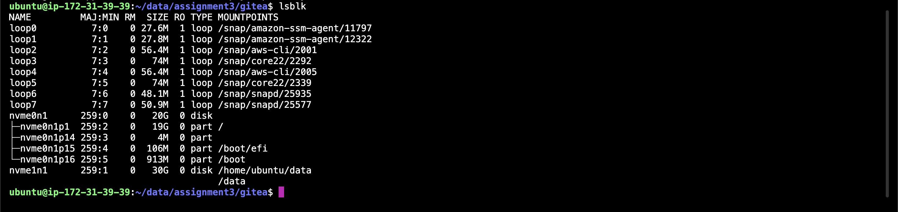
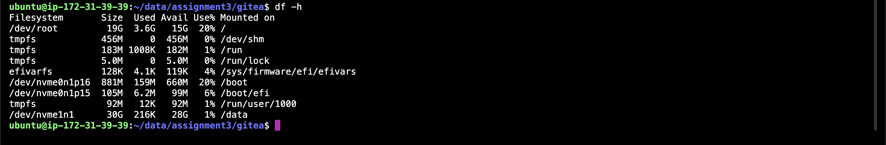
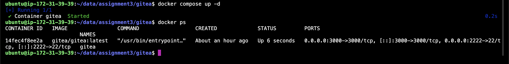
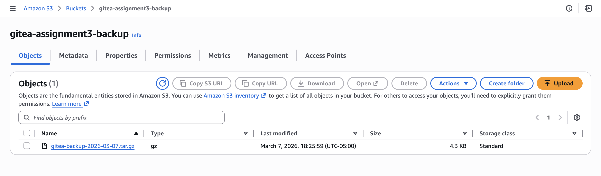
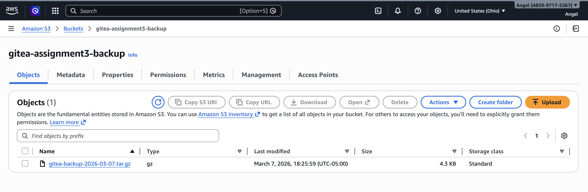

# Cloud Computing Assignment 3 — Persistent Gitea on EC2 (Docker + EBS + S3)

This deployment runs Gitea on AWS EC2 instance baked by a separate EBS volume for persistent storage and S3 bucket for automated backups.The architecture separates compute from state: the EC2 instance is disposable, while all application data lives permanently on the EBS volume mounted at /data. Gitea runs inside Docker, with a bind mount connecting the container's /data directory to the EBS volume on the host. A shell script compresses the Gitea data directory and uploads it to S3 daily, ensuring data can be recovered even if the EC2 instance is terminated.

EC2 instance -->EBS volume --> Docker/Gitea --> S3 Bucket

## Setup Requirements

- Active AWS account with EC2 and S3 access
- EC2 instance running Ubuntu (t3.micro)
- Docker installed on the instance
- AWS CLI configured (via IAM instance role — no hardcoded credentials)
- Security group open for ports 22 (SSH), 3000 (Gitea web), and 2222 (Git SSH)

---

## 1. Setting Up Persistent Storage

### EC2 and EBS Volume

Launched an Ubuntu t3.micro in **us-east-2 (Ohio)** and created a 30 GB EBS volume in the same AZ, then attached it to the instance.

### Format, Mount, and Make Persistent

```bash
# See available disks
lsblk

# Format the new volume
sudo mkfs -t ext4 /dev/nvme1n1

# Mount it
sudo mkdir -p /data
sudo mount /dev/nvme1n1 /data

# Get the UUID and add to /etc/fstab for persistence
sudo blkid /dev/nvme1n1
# UUID=27c6b14a-f3d9-4b0d-af9e-3d131d14b10b /data ext4 defaults,nofail 0 2

# Test it
sudo mount -a
df -h
```

**lsblk showing nvme1n1 (30 GB) attached and mounted:**



**df -h confirming the volume is mounted at /data with ~28 GB free:**



---

## Part B: Running Gitea in Docker

### docker-compose.yml

```yaml
services:
  gitea:
    image: gitea/gitea:latest
    container_name: gitea
    restart: always
    ports:
      - "3000:3000"    # Web interface
      - "2222:22"      # Git over SSH
    volumes:
      - /data/assignment3/gitea:/data   # Bind mount to EBS volume
```

```bash
sudo mkdir -p /data/assignment3/gitea
docker compose up -d
docker ps
```

**Container running with ports 3000 and 2222 exposed:**



### Persistence Test

```bash
# Stop and remove the container completely
docker compose down

# Delete the container completely
docker stop gitea && docker rm gitea

# Data is still on the EBS volume
ls -la /data/assignment3/gitea/

# Bring it back — data is all there
docker compose up -d
```

All repositories and user data survived complete container removal because the data lives on EBS, not inside the container.

---

## 3 Backup & Restore

### backup.sh

```bash
#!/bin/bash

DATE=$(date +%F)
BACKUP_FILE="gitea-backup-$DATE.tar.gz"

# Compress all the Gitea data
sudo tar -czvf $BACKUP_FILE /data/assignment3/gitea

# Upload to S3
aws s3 cp $BACKUP_FILE s3://gitea-assignment3-backup/

echo "Backup uploaded to S3"
```

```bash
chmod +x backup.sh
./backup.sh
```

**S3 bucket showing the uploaded backup object:**





### Restore Procedure

```bash
# 1. Stop the container first
docker compose down

# 2. Download the backup from S3
aws s3 cp s3://gitea-assignment3-backup/gitea-backup-2026-03-07.tar.gz /tmp/

# 3. Clear current data and extract
sudo rm -rf /data/assignment3/gitea/*
sudo tar -xzvf /tmp/gitea-backup-2026-03-07.tar.gz -C /

# 4. Restart — everything is back
docker compose up -d
```

I tested this by intentionally deleting a repo, restoring from the backup, and confirming it came back.

---

## What I Learned

The container is disposable — the data is not. Before this assignment I thought Docker was the whole solution, but really Docker is just the app. The data needs its own separate home (EBS), and a backup of that home somewhere safe (S3).

---
